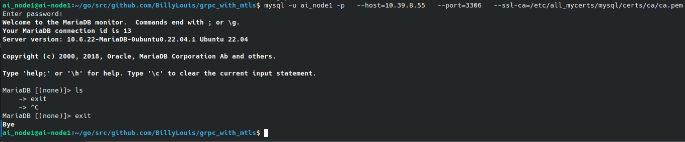
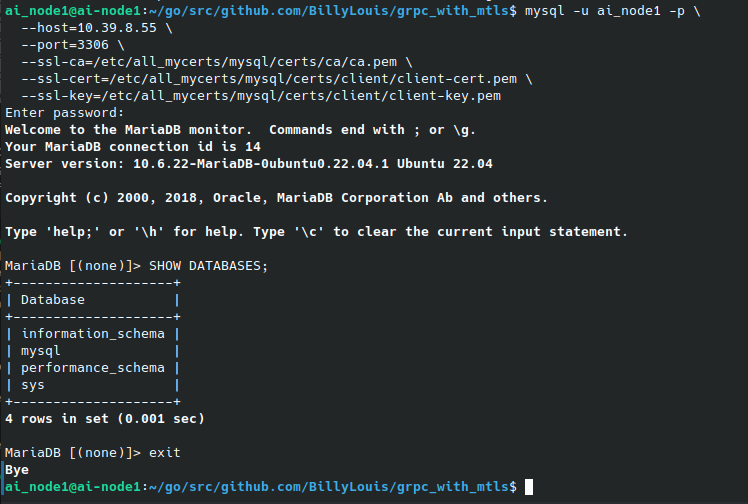

# grpc_with_mtls
Client and server gRPC endpoints with mutual TLS.  
Specifically, a sample of grpc protocol to use mutual TLS (mTLS) to authenticate & secure both end of the communication.


# Certificate Creation
```shell
#### Server Certificate Creation:
 - Create Docker Network (server container)
 - Create  Server x509 TLS certificates that runs in a Docker container
#### Docker Network:  as a server container do the followings:
...
...
...

#### To create a x509 CLient Certificate do the followings:
On the server:
---------------
#Step 1:
sudo mkdir -p /opt/mysql_tls/{ca,server,client}
cd /opt/mysql_tls

# Generate CA private key
openssl genrsa -out ca/ca-key.pem 4096

#Step 2:Generate self-signed CA certificate
openssl req -x509 -new -nodes \
  -key ca/ca-key.pem \
  -sha256 -days 1825 \
  -out ca/ca.pem \
  -subj "/C=US/ST=NV/L=LasVegas/O=BillyLabs/OU=Infra/CN=billy-ca"


# Step 3: Generate a new Certificate Authority (CA)
cat > server/server.cnf <<EOF
[req]
distinguished_name = req_distinguished_name
x509_extensions = v3_req
prompt = no

[req_distinguished_name]
CN = 10.39.8.55

[v3_req]
keyUsage = keyEncipherment, dataEncipherment
extendedKeyUsage = serverAuth
subjectAltName = @alt_names

[alt_names]
IP.1 = 10.39.8.55
EOF

#Step 4: Generate key and CSR:
openssl genrsa -out server/server-key.pem 2048

openssl req -new -key server/server-key.pem \
  -out server/server.csr \
  -config server/server.cnf

#Step 5: Sign the server cert:
openssl x509 -req -in server/server.csr \
  -CA ca/ca.pem -CAkey ca/ca-key.pem -CAcreateserial \
  -out server/server-cert.pem -days 825 -sha256 \
  -extfile server/server.cnf -extensions v3_req

#Step 6: Generate Client Certificate:
cat > client/client.cnf <<EOF
[req]
distinguished_name = req_distinguished_name
x509_extensions = v3_req
prompt = no

[req_distinguished_name]
CN = ai_node1

[v3_req]
keyUsage = digitalSignature
extendedKeyUsage = clientAuth
EOF


#Step 7:Generate client key and CSR:
openssl genrsa -out client/client-key.pem 2048

openssl req -new -key client/client-key.pem \
  -out client/client.csr \
  -config client/client.cnf

#Step 8: Sign client cert:
openssl x509 -req -in client/client.csr \
  -CA ca/ca.pem -CAkey ca/ca-key.pem \
  -out client/client-cert.pem -days 825 -sha256 \
  -extfile client/client.cnf -extensions v3_req

#Step 9: Deploy server certs to MariaDB
sudo mkdir -p /etc/mysql/certs
sudo cp ca/ca.pem server/server-cert.pem server/server-key.pem /etc/mysql/certs/
sudo chown mysql:mysql /etc/mysql/certs/*
sudo chmod 600 /etc/mysql/certs/*

# Update MariaDB config (/etc/mysql/mariadb.conf.d/50-server.cnf):
[mysqld]
ssl-ca = /etc/mysql/certs/ca.pem
ssl-cert = /etc/mysql/certs/server-cert.pem
ssl-key = /etc/mysql/certs/server-key.pem
require_secure_transport = ON

#Step 10: Restart MariaDB:
sudo systemctl restart mariadb


#### Client Certificate creation:
 To do ...
 - Create Docker Network (client container)
 - Create  client x509 TLS certificates that runs in a Docker container
#### Docker Network:  as a client container do the followings:
...
...
...
...

#### To create a x509 CLient Certificate do the followings:
On the server the client certificate is shown from the above step7 and step8
Simply copy the client certificates to the client machine and for proper permission  
issue the commands: 
 $ chmod 644 client/client-key.pem
 $ chmod 644 client/client-cert.pem

#### And directory access (Ex.)
 $ sudo chmod 755 /etc/mysql/certs/

#### move the certificates to the client and install mySQL (mariadb preferred)
 $ sudo apt install mariadb-client-core-10.6 


```

# Sample Certificates CLI verification
```shell
openssl x509 -in ca.pem -text -noout

openssl rsa -in server-key.pem -text -noout

openssl x509 -in server-cert.pem -text -noout

```

# Database Setup and Configuration
### Quick MariaDB | mySQL Test
```shell
 - Create Docker Network (database container)
 - MariaDB configuration

#### Create Docker Network (database container)
To Do ...
...
...
...
...
#### MariaDB configuration && Debugging
(After creating the certificates as shown above)
mysql -u root -p --ssl-ca=/etc/mysql/certs/ca.pem \
  --host=127.0.0.1

sudo mysql
SELECT user, host, plugin FROM mysql.user WHERE user = 'root';

----------------------------------->
#### If you see plugin = 'unix_socket', it means password-based login won't work unless you change it to "mysql_native_password".

ALTER USER 'root'@'localhost' IDENTIFIED VIA mysql_native_password USING PASSWORD('mypassword');
FLUSH PRIVILEGES;
exit

sudo systemctl restart mariadb.service

mysql -u root -p

----------------------------------->
#### If you don't want to change root, create a new user for TLS:
#### replace licalhost with a client IP. To access database server from a client machine

CREATE USER 'ai_node1'@'localhost' IDENTIFIED BY 'securepass' REQUIRE SSL;
GRANT ALL PRIVILEGES ON *.* TO 'ai_node1'@'localhost';
FLUSH PRIVILEGES;

such as (Ex.):
CREATE USER 'ai_node'@'10.39.8.81' IDENTIFIED BY 'securepass' REQUIRE SSL;
GRANT ALL PRIVILEGES ON *.* TO 'ai_node'@'10.39.8.81';
FLUSH PRIVILEGES;
#### Then
ALTER USER 'ai_node1'@'10.39.8.81' IDENTIFIED VIA mysql_native_password USING PASSWORD('mypassword');
FLUSH PRIVILEGES;

SELECT user, host, plugin FROM mysql.user WHERE user = 'ai_node1';

SELECT user, host, plugin FROM mysql.user;

exit

sudo systemctl restart mariadb.service

SELECT user, host, plugin FROM mysql.user WHERE user = 'ai_node1';

SELECT user, host, plugin FROM mysql.user;


#### TLS connection (Ex. Server IP: 10.39.8.55):
mysql -u root -p \
  --host=10.39.8.55 \
  --port=3306 \
  --ssl-ca=/etc/mysql/certs/ca.pem


#### mutual TLS Connection (Ex. Server IP: 10.39.8.55):
mysql -u root -p \
  --host=10.39.8.55 \
  --port=3306 \
  --ssl-ca=/etc/mysql/certs/ca.pem \
  --ssl-cert=/etc/mysql/certs/client-cert.pem \
  --ssl-key=/etc/mysql/certs/client-key.pem


******** note: replace root with ai_node1 if running the command on the client
ai_node1 is arbitrary, use your own PC/Host name. ********

A sample of calling the mariadb server from a client is shown in the image below using
only one side authentication (the client):
```



## #####################################################
```shell
Both side using Server and Client Authentication, hence mTLS. As shown in the iamge below:

```



## #####################################################
# Proto Buff Creation
```shell
 To do ...
 - Install libs/packages to generate protobuff

```

### Output of a client & server mTLS exchange:
```shell
When the certificates of verified on both client & server, the connection is established and data exchanges can be done.
If even one character is changed from the certificates the connection cannot be establish to exchange the secured endpoints.
As shown in  the image below:

![alt text (TODO: image not ready)]

```


# Authors
- [Billy Louis](): TCP/IP connection between Client and Server using Golang RPC (GRPC)


# Badges
Hardware Team: [NSAL.com](https://NSAL.com/)

[](https://choosealicense.com/licenses/nsal/)
